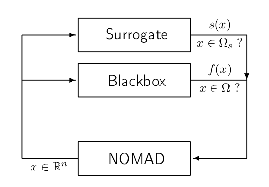

.. _advanced_functionalities:

Advanced functionalities
========================

Advanced parameters
-------------------

Advanced parameters are intended to setup optimization problems, algorithmic and output parameters when specific needs are present.
Only a few advanced parameters are presented below; all advanced parameters can be obtained with ``$NOMAD_HOME -h advanced``.
Also a complete list of parameters and a short description is available in :ref:`appendix_parameters`.

.. _eval_queue_sort:

``EVAL_QUEUE_SORT``
"""""""""""""""""""

Allows ordering of points before evaluation. This option has an effect only if the opportunistic strategy is enabled (parameter :ref:`eval_opportunistic`). The possible arguments are:

* ``DIR_LAST_SUCCESS``: Points that are generated in a direction similar to the last direction that provided a successful point are evaluated first.

* ``LEXICOGRAPHICAL``: Points are sorted in lexicographical order before evaluation.

* ``RANDOM``: Mix points randomly before evaluation, instead of sorting them.

* ``SURROGATE``: Sort points using values given by static surrogate. See parameter :ref:`surrogate_exe`.

.. _fixed_variable:

``FIXED_VARIABLE``
""""""""""""""""""

This parameter is used to fix some variables to a value.
This value is optional if at least one starting point is defined.
The parameter may be entered with several types of arguments:

* A vector of :math:`n` values with format ``(v0 v1 ... vn-1)``. Character ``-`` is used for free variables.

* An index range if at least one starting point has been defined. ``FIXED_VARIABLE i-j``: variables ``i`` to ``j``
  are fixed to their initial (``i-j`` may be replaced by ``i`` only). See :ref`x0` for practical examples of index ranges.

.. _seed:

``SEED``
""""""""

The directions that NOMAD explores during the *Poll* phase are dependent upon the seed.
The seed is used to generate a pseudo-random direction on a unit n-dimensional sphere.
The user can change the sequence of directions by setting ``SEED`` to a positive integer or ``-1``. If ``-1`` or ``DIFF`` is entered the seed is different for each run (PID is used).

Other aspects of NOMAD may depend on a pseudo-random sequence of numbers depending on selected options: *LH Search* and *PSD Mads*.

.. _eval_opportunistic:

``EVAL_OPPORTUNISTIC``
""""""""""""""""""""""

The opportunistic strategy consists in terminating the evaluations of a list of trial points at a given step of the algorithm as soon as an improved value is found.

This strategy is decided with the parameter ``EVAL_OPPORTUNISTIC`` and applies to both the *Poll* and *Search* steps.
Search with NOMAD help ``$NOMAD_HOME/bin/nomad -h OPPORTUNISTIC`` for more options.

When evaluations are performed by blocks (see :ref:`block_evaluations`) the opportunistic strategy applies after evaluating a block of trial points.

.. _variable_group:

``VARIABLE_GROUP``
""""""""""""""""""

By default NOMAD creates one group that combines all continuous, integer, and binary variables.

In batch mode, the ``VARIABLE_GROUP`` parameter followed by variable indices is used to explicitly form a group of variables.
Each group of variable generates its own polling directions. The parameter may be entered several times to define more than one group of variables.
Variables in a group may be of different types.

.. _quad_model_search:

``QUAD_MODEL_SEARCH`` and ``SGTELIB_MODEL_SEARCH``
""""""""""""""""""""""""""""""""""""""""""""""""""

The *Search* phase of the *MADS* algorithm can use models of the objectives and constraints that are constructed dynamically from all the evaluations made.
By default, a quadratic model is used to propose new points to be evaluated with the blackbox.
To disable the use of quadratic models, the parameter ``QUAD_MODEL_SEARCH`` can be set to ``no``.

Models from the *SGTELIB* library can be used by setting ``SGTELIB_MODEL_SEARCH`` to ``yes``.
Many parameters are available to control *SGTELIB* models: ``$NOMAD_HOME/bin/nomad -h SGTELIB``.

.. _vns_search:

``VNS_MADS_SEARCH``
"""""""""""""""""""

The *Variable Neighborhood Search (VNS)* is a strategy to escape local minima.

The VNS Mads search strategy is described in [AuBeLe08b]_. It is based on the Variable Neighborhood Search metaheuristic [MlHa97a]_ and [HaMl01a]_.

VNS Mads should only be used for problems with several such local optima. It will cost some additional evaluations, since each search performs another MADS run from a perturbed starting point. Currently, the VNS Mads search will not use a surrogate if it is provided. This feature will be available in the future.

In NOMAD, the VNS Mads search strategy is not activated by default. In order to use the VNS Mads search, the user has to define the parameter ``VNS_MADS_SEARCH``, with a boolean. The maximum desired ratio of VNS Mads blackbox evaluations over the total number of blackbox evaluations is specified with the real value parameter ``VNS_MADS_SEARCH_TRIGGER``. For example, a value of 0.75 means that  NOMAD will try to perform a maximum of 75% blackbox evaluations  within the VNS Mads search. The default trigger ratio is 0.75.

.. _granularity:

``GRANULARITY``
"""""""""""""""

The *MADS* algorithm handles granular variables, i.e. variables with a controlled number of decimals.
For real numbers the granularity is 0. For integers and binary variables the granularity is automatically set to one.

The possible syntaxes to specify the granularity of the variables are as follows:

* :math:`n` real values with format ``GRANULARITY (v0 v1 ... vn-1)``.

* ``GRANULARITY i-j v``: coordinates  ``i` to  ``j`` set to ``v``.

* ``GRANULARITY * v``: all coordinates set to ``v``.

.. _surrogate_exe:

``SURROGATE_EXE``
"""""""""""""""""

Static surrogate executable.

A static surrogate, or static surrogate function, is a cheaper blackbox function that is used, at least partially, to drive the optimization.

   Blackbox optimization using a surrogate

.. note:: The static surrogate is provided by the user.

The current version of NOMAD can use a static surrogate, provided by the user, which is not updated during the algorithm. See [BoDeFrSeToTr99a]_ for a survey on surrogate optimization, and [AuCM2019]_ about using static surrogate evaluations. This surrogate may be used for sorting points before evaluation (see parameter :ref:`eval_queue_sort`).

In batch mode, the parameter ``SURROGATE_EXE`` associates a static surrogate executable with the blackbox executable given by parameter ``BB_EXE``. The surrogate must display the same input and output types as its associated blackbox, given by parameters ``BB_INPUT_TYPE`` and ``BB_OUTPUT_TYPE``. In library mode, if a surrogate function is to be used, then its Evaluator should be of type ``EvalType::SURROGATE`` (see Section :ref:`library_mode`).

.. _block_evaluations:

Blackbox evaluation of a block of trial points
----------------------------------------------

At different phases of the MADS algorithm, different numbers of trial points are generated.
For example, having selected the direction type as ORTHO 2N, the maximum number of points generated during
the Poll step will be 2N+2. These points can be partitioned into blocks of trial points to be
submitted sequentially for evaluation to a blackbox program. The maximum size of a block of
evaluations is controlled by the BB_MAX_BLOCK_SIZE. By default, a block contains a single trial
point. This can be changed by the user but the blackbox program must support the evaluation
of a varying number of trial points, up to BB_MAX_BLOCK_SIZE.

Due to the strategy of by-block evaluation, the maximum number of evaluations requested to
NOMAD may be exceeded if BB_MAX_BLOCK_SIZE > 1. The reason for this behaviour is that
block results are analyzed only after completion and the maximum number of evaluations may
be exceeded when checking this termination criterion.
The opportunistic strategy (enabled by default) may apply after each block of trial points.
Evaluations of blocks of trial points can be performed in parallel by the blackbox program. This
strategy of parallelization must be setup by the user within the blackbox. Examples are provided
in what follows.

Batch mode
""""""""""

In batch mode, NOMAD creates input files which can contain at most
BB_MAX_BLOCK_SIZE trial points separated by a linebreak. Each point is given as a row of values.
The user must provide a blackbox program that can read the input file, evaluate them and
output the objective and constraints functions (in the order provided by the BB_OUTPUT_TYPE
parameter) for each trial point in the same order as provided in the input file.
A blackbox program may fail to evaluate some of the trial points. When block of trial points is
submitted the content of the output file must reflect the outputs for each point.
If one value provided in the output file
cannot be read by NOMAD, then the corresponding trial point is considered as having failed.
The trial points that have failed will not be evaluated again.
An example of blackbox program written is provided in the
directory ``$NOMAD_HOME/examples/basic/batch/single_obj_parallel``.
The executable ``bb3.exe`` evaluates up to 4 trial points in parallel.

::

  > cd $NOMAD_HOME/examples/basic/batch/single_obj_parallel
  > more x.txt
  1 2 3 4 5
  0 0 0 0 0
  2 2 2 2 2
  5 4 3 2 1
  > bb3.exe x.txt
  5 5 -65
  0 -20 20
  2 -20 -20
  1 5 -65

The same directory holds the parameter file that specifies this blackbox program with blocks of 4 trial points:

::

    DIMENSION      5              # number of variables

    BB_EXE bb3.exe
    BB_MAX_BLOCK_SIZE 4

    BB_OUTPUT_TYPE OBJ PB EB

    X0             ( 0 0 0 0 0 )  # starting point

    LOWER_BOUND    * -6.0         # all variables are >= -6
    UPPER_BOUND    ( 5 6 7 - - )  # x_1 <= 5, x_2 <= 6, x_3 <= 7
                                  # x_4 and x_5 have no bounds

    MAX_BLOCK_EVAL     20         # the algorithm terminates when
                                  # 20 blocks have been evaluated

    TMP_DIR /tmp
    DISPLAY_DEGREE 2
    DISPLAY_STATS BLK_EVA BLK_SIZE OBJ
    DISPLAY_ALL_EVAL true

When evaluations are performed by blocks, i.e., when ``BB_MAX_BLOCK_SIZE`` is greater
than one, the opportunistic strategy applies after evaluating a block of trial points.

Library mode
""""""""""""

Please refer to ``$NOMAD_HOME/examples/basic/library/single_obj_parallel`` for an example
on how to manage a block of evaluations in parallel using OpenMP.

.. _parallel_evaluations:

Parallel evaluations
--------------------

When OpenMP is available (see :ref:`Use OpenMP <cmake_configuration>`), the user may provide the number of threads ``NB_THREADS_OPENMP``
to efficiently access the computer cores. If this parameter is not set, OpenMP computes
the number of available threads. The evaluations of trial points are dispatched to these threads.

.. _psd_mads:

PSD-Mads
--------

The PSD-MADS method implements a parallel space decomposition of MADS and is
described in [AuDeLe07]_. The method aims at solving larger problems than the scalar version of
NOMAD.
NOMAD is in general efficient for problems with up to about 20 variables, PSD-MADS has
solved problems with up to 500 variables.
In PSD-MADS, each worker process has the responsibility for a small number of variables on
which a MADS algorithm is performed. These subproblems are decided by the PSD-MADS algorithm.
These groups of variables
are chosen randomly, without any specific strategy.
A special worker, called the pollster,
works on all the variables, but with a reduced number of directions. The pollster ensures the
convergence of the algorithm.
Concerning other aspects, the algorithm given here is similar to the program PSD-MADS given
with NOMAD 3.

The management of parallel processes is done using OpenMP.
To use PSD-MADS, set parameter ``PSD_MADS_OPTIMIZATION`` to ``true``.
Thread 0 is used for the pollster.
The next ``PSD_MADS_NB_SUBPROBLEM`` threads are used for subproblems. If this parameter is not
set, it is computed using ``PSD_MADS_NB_VAR_IN_SUBPROBLEM``.
Remaining available threads are not used for algorithmic management or point generation,
only for point evaluation.
An example of usage of PSD-MADS in library mode is in
``$NOMAD_HOME/examples/advanced/library/PSDMads``.

.. topic:: References

  .. [AuBeLe08b] C. Audet, V. Béchard, and S. Le Digabel.
    Nonsmooth optimization through mesh adaptive direct search and variable neighborhood search.
    *Journal of Global Optimization*, 41(2):299– 318, 2008.

  .. [AuCM2019] C. Audet and J. Côté-Massicotte.
    Dynamic improvements of static surrogates in direct search optimization.
    *Optimization Letters* 13, 6 (2019), 1433-1447

  .. [AuDeLe07] C. Audet, J.E. Dennis, Jr., and S. Le Digabel.
    Parallel space decomposition of the mesh adaptive direct search algorithm.
    *SIAM Journal on Optimization*, 19(3):1150–1170, 2008.

  .. [BoDeFrSeToTr99a] A.J. Booker, J.E. Dennis, Jr., P.D. Frank, D.B. Serafini, V. Torczon, and M.W. Trosset.
    A Rigorous Framework for Optimization of Expensive Functions by Surrogates.
    *Structural and Multidisciplinary Optimization*, 17(1):1–13, 1999.

  .. [HaMl01a] P. Hansen and N. Mladenović.
    Variable neighborhood search: principles and applications.
    *European Journal of Operational Research*, 130(3):449–467, 2001.

  .. [MlHa97a] N. Mladenović and P. Hansen.
    Variable neighborhood search.
    *Computers and Operations Research*, 24(11):1097–1100, 1997.

