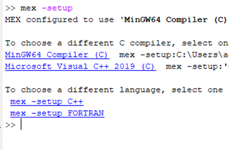
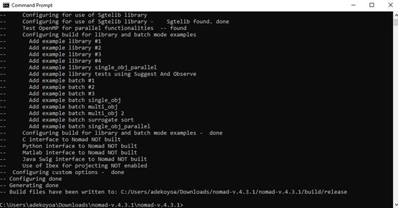
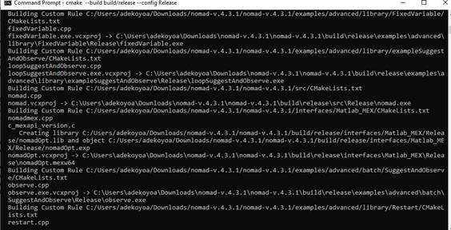
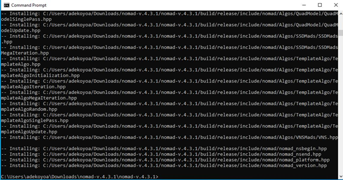
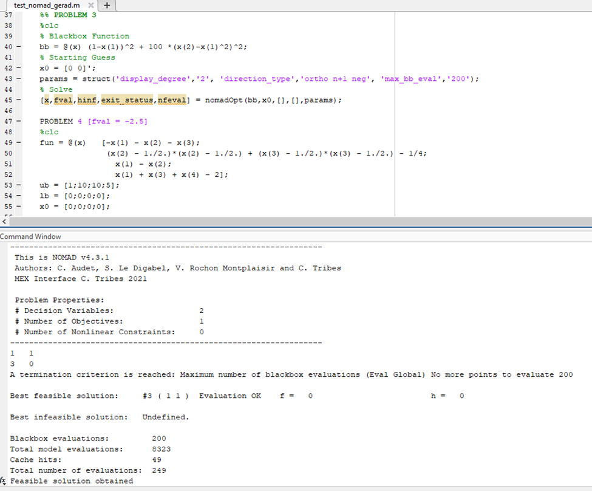

.. _guide_matlab_mex:

Guide to build Matlab interface for Windows using MinGW
=======================================================

The following guide for building Matlab interface for Windows using MinGW  has been provided by a user in `GitHub Issue #128 <https://github.com/bbopt/nomad/issues/128>`_.

`*` Update MATLAB’s MinGW using this `link to supported compilers <https://www.mathworks.com/support/requirements/supported-compilers.html>`_.
Follow on-screen instructions (for example, dragging and dropping in MATLAB’s command window)
NB: Updates will be displayed in MATLAB’s Command window while installation is in progress.

`*` Confirm set up by typing ``mex -setup`` in command window to verify installation following completion (Please check MATLAB and Simulink requirements on the same page using the link above as well)

`*` Majority of the other installation procedures would be done using "Command Prompt Window". This can easily be accessed by typing "Command window" in the search tile on your Windows operating system.

`*` Download `CMake <https://cmake.org/download/>`_. I recommend using the Windows x64 Installer option to enable you make your own installation settings. Make sure it is available for all users of the PC. Confirm that cmake is on the PC by typing ``cmake`` on command prompt.

`*` Download your preferred NOMAD version and unzip the file. In the root folder, get a link which is done by easily double-clicking on the pane which bears the opened folder.

`*` The interface build is managed by CMake that can be run at NOMAD root. Use the command ``cd copiedAddress`` command in command prompt to change the directory to the location you have copied above (replace copiedAddress with the link obtained)

`*` To build the MATLAB interface, force the use of the 64bit version of the compiler with the command::

  cmake -DTEST_OPENMP=OFF -DBUILD_INTERFACE_MATLAB=ON -S . -B build/release -A x64

`*` Following the completion, use the command below that might take some minutes::

  cmake --build build/release --config Release

`*` Then, finally, use the command::

  cmake --install build/release

which must be run before using the Matlab nomadOpt function. You can expect to see the following during the build process:

`*` Make sure to add NOMAD subfolders on MATLAB before testing the installation. On MATLAB’s Home, use the "Set Path" menu to "Add with Subfolders" the whole NOMAD folder so that functions can easily be accessed

`*` Run examples provided in the installation folder to confirm that the functions can now be called easily from MATLAB’s command window. For example, trying to solve problem three (3) should give you something similar to:

.. figure:: ../figs/mexrun1.png
   :align: center

.. _appendix_parameters:

Complete list of parameters
===========================

A set of parameters is available in the table below for fine tuning algorithmic settings. Additional information on each parameter is available by typing ``$NOMAD_HOME/bin/nomad -h PARAM_NAME``.

.. csv-table:: NOMAD 4 parameters
   :file: ../source/allParameters.csv
   :widths: 20,3,10,50,10

.. toctree::
  :hidden:

  ListOfParameters
