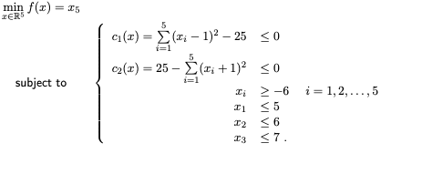

.. _getting_started:

Getting started
===============

NOMAD is an efficient tool for simulation-based design optimizations provided in the form:

.. math::

   \min_{x \in \Omega} f(x)

where the feasible set :math:`\Omega = \{ x \in X : c_j(x) \leq 0, j \in J\} \subset \mathbb{R}^n`, :math:`f, c_j : X \rightarrow \mathbb{R} \cup \{ \infty \}` for  all :math:`j \in J= \{ 1,2,\ldots,m \}`, and where :math:`X` is a subset of :math:`\mathbb{R}^n`. The functions :math:`f` and :math:`c_j`, :math:`j ∈ J`, are typically blackbox functions whose evaluations require computer simulation.

NOMAD can be used in two different modes: batch mode and library mode. The batch mode is intended for a basic usage and is briefly presented below (more details will be provided in :ref:`basic_nomad_usage`).
This chapter explains how to get started with NOMAD in batch mode. The following topics will be covered:

* How to create a blackbox program.
* How to provide parameters for defining the problem and displaying optimization results.
* How to conduct optimization.

.. warning::
   Building NOMAD binaries and running the examples provided during the installation requires to have a ``C++`` compiler installed on your machine.
   Basic compilation instructions will be provided for **GCC** (the GNU Compiler Collection).

Create blackbox programs
^^^^^^^^^^^^^^^^^^^^^^^^

To conduct optimization in batch mode the users must define their separate blackbox program coded as a standalone program. Blackbox program executions are managed by NOMAD with system calls.

.. sidebar:: A valid blackbox program:

    - takes an input vector file as single argument,

    - reads space-separated values in input vector file,

    - returns evaluation values on standard output or file,

    - returns an evaluation status.

In what follows we use the example in the ``$NOMAD_HOME/examples/basic/batch/example1``. This example optimization problem has a single objective, 10 variables, 3 nonlinear constraints and 20 bound constraints.

.. warning:: The blackbox programs may be coded in any language (even scripts) but must respect **NOMAD format**:

    1. The blackbox program must be callable in a terminal window at the command prompt and take the input vector file name as a single argument. For the example above, the blackbox executable is ``bb.exe``, one can execute it with the command  ``./bb.exe x.txt``. Here ``x.txt`` is a text file containing a total of 5 values.

    2. NOMAD will manage the creation of the **input file consisting of one value for each variable separated by space** and the execution of the blackbox program.

    3. The blackbox program must return the evaluation values by displaying them in the **standard output** (default) or by writing them in an output file (see :ref:`advanced_functionalities` about advanced output options). It must also **return an evaluation status of 0** to indicate that the evaluation went well. Otherwise NOMAD considers that the evaluation has failed.

    4. The minimum number of values displayed by the blackbox program corresponds to the number of constraints plus one (or two for bi-objective problems) representing the objective function(s) that one seeks to minimize. The constraints values correspond to left-hand side of constraints of the form :math:`c_j \leq 0` (for example, the constraint :math:`0 \leq x_1 + x_2 \leq 10` must be displayed with the two quantities :math:`c_1(x)=-x_1-x_2` and :math:`c_2(x)=x_1+x_2-10`).

The blackbox ``C++`` program of the previous example to evaluate the objective and the two constraints for a given design vector is given as:

.. code-block:: c++
   :linenos:

   #include <fstream>      // For ifstream
   #include <iostream>
   #include <cmath>        // For sqrt
   #include <stdexcept>    // For logic_error

   const int n = 10;

   int main (int argc, char **argv)
   {
       bool eval_ok = false;

       // Remotely based on G2.
       double f = 1e+20, g1 = 1e+20, g2 = 1e+20, g3 = 1e+20;
       double sum1 = 0.0, sum2 = 0.0, sum3 = 0.0, prod1 = 1.0, prod2 = 1.0;
       double x[n];

       bool x0read = false;
       if (argc >= 2)
       {
           std::string x0file = argv[1];
           std::ifstream in (argv[1]);
           for (int i = 0; i < n; i++)
           {
               if (in.fail())
               {
                   std::cerr << "Error reading file " << x0file << " for x0." << std::endl;
                   x0read = false;
                   break;
               }
               in >> x[i];
               x0read = true;
           }
           in.close();
       }

       if (x0read)
       {
           try
           {
               for (int i = 0; i < n ; i++)
               {
                   sum1  += pow(cos(x[i]), 4);
                   sum2  += x[i];
                   sum3  += (i+1)*x[i]*x[i];
                   prod1 *= pow(cos(x[i]), 2);
                   if (prod2 != 0.0)
                   {
                       if (x[i] == 0.0)
                       {
                           prod2 = 0.0;
                       }
                       else
                       {
                           prod2 *= x[i];
                       }
                   }
               }

               g1 = -prod2 + 0.75;
               g2 = sum2 -7.5 * n;

               f = 10*g1 + 10*g2;
               if (0.0 != sum3)
               {
                   f -= (sum1 -2*prod1) / std::abs(sqrt(sum3));
               }
               // Scale
               if (!std::isnan(f))
               {
                   f *= 1e-5;
               }

               eval_ok = !std::isnan(f);

               g3 = - (f + 2000);
           }
           catch (std::exception &e)
           {
               std::string err("Exception: ");
               err += e.what();
               throw std::logic_error(err);
           }
       }

       std::cout << f << " " << g1 << " " << g2 << " " << g3 << std::endl;

       // Return 0 if eval_ok.
       return !eval_ok;
   }

With **GNU compiler** ``g++``, the blackbox compilation and test are as follows:

1. Change directory to ``$NOMAD_HOME/examples/basic/batch/single_obj``.

2. Compile the blackbox program  with the following command ``g++ -o bb.exe bb.cpp``.

3. Test the executable with the text file ``x0.txt`` containing ``5.0 5.0 5.0 5.0 5.0 5.0 5.0 5.0 5.0 5.0`` by entering the command ``bb.exe x0.txt``.

4. This test  should display ``-976.565 -9.76562e+06 -25 -1023.44``, which means that the point :math:`x = (5~5~5~5~5~5~5~5~5~5)^T` has an objective value of :math:`f(x)=-976.565`, but is not feasible, since the all constraints verify  (:math:`c_j(x)<=0`).

::

  > cd $NOMAD_HOME/examples/basic/batch/example1
  > g++ -o bb.exe bb.cpp
  > more x0.txt
  5.0 5.0 5.0 5.0 5.0 5.0 5.0 5.0 5.0 5.0
  > ./bb.exe x0.txt
  -976.565 -9.76562e+06 -25 -1023.44

.. warning::

  The order of the displayed outputs must correspond to the order defined in the parameter file (see `BB_OUTPUT_TYPE <output types>`_ below).
  If variables have bound constraints, they must be defined in the parameters file and should not appear in the blackbox code.

Provide parameters
^^^^^^^^^^^^^^^^^^

In batch mode, the parameters are provided in a text file using predefined keywords followed by one or more argument.

.. note::

  Help on parameters is accessible at the command prompt:
  ``$NOMAD_HOME/bin/nomad -h param_name``

Here are some of the most important parameters defining an optimization problem (without brackets):

* The number of variables (``DIMENSION n``).
* The name of the blackbox executable that outputs the objective and the constraints (``BB_EXE bb_name``).
* Bounds on variables are defined with the ``LOWER_BOUND lb`` and ``UPPER_BOUND ub`` parameters.
* The _`output types` of the blackbox executable: objective and constraints (``BB_OUTPUT_TYPE obj cons1 ... consM``).
* A starting point (``X0 x0``).
* An optional stopping criterion (``MAX_BB_EVAL max_bb_eval``, for example). If no stopping criterion is specified, the algorithm will stop as soon as the mesh size reaches a given tolerance.
* Any entry on a line is ignored after the character ‘#’.

.. note::

  The order in which the parameters appear in the file or their case is unimportant.

The parameter file for the example is as follows:

::

  # PROBLEM PARAMETERS
  ####################

  # Number of variables
  DIMENSION 10

  # Black box
  BB_EXE bb.exe
  BB_OUTPUT_TYPE OBJ PB PB EB

  # Starting point
  X0 ( 5.0 5.0 5.0 5.0 5.0 5.0 5.0 5.0 5.0 5.0 )

  # Bounds are useful to avoid extreme values
  LOWER_BOUND * -20.0
  UPPER_BOUND *  20.0

  # Some variables must be multiple of 1, others of 0.5
  GRANULARITY ( 1 1 0.5 1 1 1 1 0.5 1 1 )

  # ALGORITHM PARAMETERS
  ######################

  # The algorithm terminates after that number black-box evaluations
  MAX_BB_EVAL 1000

  # The algorithm terminates after that total number of evaluations,
  # including cache hits
  MAX_EVAL 200

  # Parameters for display
  DISPLAY_DEGREE 2
  DISPLAY_ALL_EVAL 1
  DISPLAY_STATS BBE ( SOL ) OBJ

The constraints defined in the parameters file are of different types. The first and second constraint :math:`c_1(x) \leq 0` and :math:`c_2(x) \leq 0` are treated by  the *Progressive Barrier* approach (*PB*), which allows constraint violations.  The third constraint, :math:`c_3(x) \leq 0`, is treated by the  *Extreme Barrier* approach (*EB*) that forbids violations. Hence, evaluations not satisfying *EB* constraints are simply not considered when trying to improve the solution.

Conduct optimization
^^^^^^^^^^^^^^^^^^^^

Optimization is conducted by starting NOMAD executable in a command window with the parameter file name given as argument. To illustrate the execution, the example provided in ``$NOMAD_HOME/examples/basic/batch/example1/`` is considered:

::

  > cd $NOMAD_HOME/examples/basic/batch/example1
  > ls
  bb.cpp  bb.exe  param.txt  x.txt
  >$NOMAD_HOME/bin/nomad param.txt

Todo
