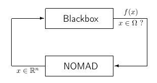
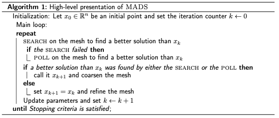

.. _introduction:

Introduction
============

.. note::
   NOMAD = Nonlinear Optimization by Mesh Adaptive Direct Search

NOMAD is a software application for simulation-based optimization. It can efficiently explore a design space in search of better solutions for a large spectrum of optimization problems. NOMAD is at its best when  applied to blackbox functions.

   Blackbox optimization

Such functions are typically the result of expensive computer simulations which

* have no exploitable property such as derivatives,
* may be contaminated by noise,
* may fail to give a result even for feasible points.

NOMAD  is a ``C++`` implementation of the  **Mesh Adaptive Direct Search (MADS)** algorithm (see references [AbAuDeLe09]_, [AuDe2006]_, [AuDe09a]_ for details) designed for constrained optimization of blackbox functions in the form

.. math::

   \min_{x \in \Omega} f(x)

where the feasible set :math:`\Omega = \{ x \in X : c_j(x) \leq 0, j \in J\} \subset \mathbb{R}^n`, :math:`f, c_j : X \rightarrow \mathbb{R} \cup \{ \infty \}` for  all :math:`j \in J= \{ 1,2,\ldots,m \}`, and where :math:`X` is a subset of :math:`\mathbb{R}^n`.

NOMAD also implements the  **DMultiMads** algorithm (see references [BiLedSa2020]_ and :ref:`advanced_functionalities`) for solving multiobjective optimization problems.

.. Preface

.. In many situations, one is interested in identifying the values of a set of variables that maximize or minimize some objective function. Furthermore, the variables cannot take arbitrary values, as they are confined to an admissible region and need to satisfy some prescribed requirements. NOMAD is a software application designed to solve these kind of problems.

.. The nature of the objective function and constraints dictates the type of optimization methods that should be used to tackle a given problem. If the optimization problem is convex, or if the functions are smooth and easy to evaluate, or if the number of variables is large, then NOMAD is not the solution that you should use. NOMAD is intended for time-consuming blackbox simulation with a small number of variables. NOMAD is often useful when other optimizers fail.

.. These nasty problems are called blackbox optimization problems. With NOMAD some constraints may be evaluated prior to launching the simulation, and others may only be evaluated a posteriori. The simulations may take several seconds, minutes, hours or even days to compute. The blackbox can have limited precision and be contaminated with numerical noise. It may also fail to return a valid output, even when the input appears acceptable. Launching twice the simulation from the same input may produce different outputs. These unreliable properties are frequently encountered when dealing with real problems. The term blackbox is used to indicate that the internal structure of the target problem, such as derivatives or their approximations, cannot be exploited as it may be unknown, hidden, unreliable or inexistent. There are situations where some structure such as bounds may be exploited and in some cases, a surrogate of the problem may be supplied to NOMAD or a model may be constructed and trusted.

.. This guide describes how to use NOMAD to solve your blackbox optimization problem.

Basics of the MADS algorithm
^^^^^^^^^^^^^^^^^^^^^^^^^^^^

At the core of NOMAD resides the *Mesh Adaptive Direct Search (MADS)* algorithm.
As the name implies, this method generates iterates on a series of meshes with varying size.
A mesh is a discretization of the space of variables.
However, also as the name implies, the algorithm performs an adaptive search on the meshes including controlling the refinement of the meshes.
The reader interested in the rather technical details should read Reference [AuDe2006]_.

The objective of each iteration of the *MADS* algorithm, is to generate a trial point on the mesh that improves the current best solution.
When an iteration fails to achieve this, the next iteration is initiated on a finer mesh.

Each iteration is composed of two principal steps called the *Search* and the *Poll* steps [AuDe2006]_.
The *Search* step is crucial in practice because it is so flexible and can improve the performance significantly.
The *Search* step is constrained by the theory to return points on the underlying mesh, but of course,
it is trying to identify a point that improves the current best solution.

The *Poll* step is more rigidly defined, though there is still some flexibility in how this is implemented.
The *Poll* step generates trial mesh points in the vicinity of the best current solution.
Since the *Poll* step is the basis of the convergence analysis, it is the part of the algorithm where most research has been concentrated.

A high-level presentation of *MADS* is shown in the pseudo-code below.

Using NOMAD
^^^^^^^^^^^

.. warning::
   NOMAD does not provide a graphical user interface to define and perform optimization.

Minimally, users must accomplish several tasks to solve their own optimization problems:

* Create a custom blackbox program(s) to evaluate the functions :math:`f` and :math:`c_j` OR embed
  the functions evaluations in C++ source code to be linked with the NOMAD library.

* Create the optimization problem definition in a parameter file OR embed the problem definition in C++ source code to be linked with the NOMAD library.

* Launch the execution at the command prompt OR from another executable system call.

Users can find several examples provided in the installation package and described in this user guide to perform customization for their problems.
The installation procedure is given in :ref:`installation`. New users should refer to :ref:`getting_started`.
The most important instructions to use NOMAD are in :ref:`basic_nomad_usage`.
In addition, tricks that may help solving specific problems and improve NOMAD efficiency are presented in :ref:`tricks_of_the_trade`.
Advanced parameters and functionalities are presented in :ref:`advanced_functionalities`.

Supported platforms and environments
^^^^^^^^^^^^^^^^^^^^^^^^^^^^^^^^^^^^

NOMAD source codes are in C++ and are identical for all supported platforms.
See :ref:`installation` for details to obtain binaries from the source files.

Authors and fundings
^^^^^^^^^^^^^^^^^^^^

The development of NOMAD started in 2001. Three versions of NOMAD have been developed before NOMAD 4.
NOMAD 4 and NOMAD 3 are currently supported. NOMAD 4 is almost a completely new code compared with NOMAD 3.

NOMAD 4 has been funded by Huawei Canada, Rio Tinto, Hydro-Québec, NSERC (Natural Sciences and Engineering Research Council of Canada), InnovÉÉ (Innovation en Énergie Électrique) and IVADO (The Institute for Data Valorization)

NOMAD 3 was created and developed by Charles Audet, Sebastien Le Digabel, Christophe Tribes and Viviane Rochon Montplaisir and was funded by AFOSR and Exxon Mobil.

NOMAD 1 and 2 were created and developed by Mark Abramson, Charles Audet, Gilles Couture, and John E. Dennis Jr., and were funded by AFOSR and Exxon Mobil.

The library for dynamic surrogates (SGTELIB) has been developed by Bastien Talgorn (bastien-talgorn@fastmail.com), McGill University, Montreal.
The SGTELIB is included in NOMAD since version 3.8.0.

**Developers** of the methods behind NOMAD include:

* Mark A. Abramson (abramson@mathematics.byu.edu), Bringham Young University.
* Charles Audet (`<https://www.gerad.ca/Charles.Audet>`_), GERAD and Département de mathématiques et de génie industriel, École Polytechnique de Montréal.
* J.E. Dennis Jr. (`<http://www.caam.rice.edu/∼dennis>`_), Computational and Applied Mathematics Department, Rice University.
* Sébastien Le Digabel (`<http://www.gerad.ca/Sebastien.Le.Digabel>`_), GERAD and Département de mathématiques et de génie industriel, École Polytechnique de Montréal.
* Viviane Rochon Montplaisir (`<https://www.linkedin.com/in/montplaisir>`_).
* Christophe Tribes, GERAD (`<https://www.gerad.ca/en/people/christophe-tribes>`_) and Département de mathématiques et de génie industriel, École Polytechnique de Montréal.

Acknowledgments
^^^^^^^^^^^^^^^

The developers of NOMAD wish to thank Florian Chambon, Mohamed Sylla and Quentin Reynaud, all from ISIMA, for their contribution
to the project during Summer internships, and to Anthony Guillou and Dominique Orban for their help with AMPL, and their suggestions.

A special thank to Maud Bay, Eve Bélisle, Vincent Garnier, Michal Kvasnička, Alexander Lutz, Rosa-Maria Torres-Calderon, Yuri Vilmanis, Martin Posch, Etienne Duclos, Emmanuel Bigeon, Walid Zghal, Jerawan Armstrong, Stéphane Alarie and Klaus Truemper for their feedbacks and tests that significantly contributed to improve NOMAD. Some features of NOMAD have been developed under the impulsion of enthusiastic users/developers: Andrea Ianni, Florian Chambon, Mohamed Sylla, Quentin Reynaud, Amina Ihaddadene, Bastien Talgorn, Nadir Amaioua and Catherine Poissant.
We also wish to thank Pascal Côté for his contribution in the development of the Python interface pyNomad and Jonathan Currie for the development of the foundations for a strong NOMAD interface for MATLAB.
Another special thank to Jean-Max Redonnet for pushing the development of the Java Swig interface.

The contributions of  Miguel Anjos, Romain Couderc, Miguel Diago Martinez, Solène Kojtych, Guillaume Lameynardie, Wim Lavrijsen, Alexis Montoison, Caroline Rocha, Ludovic Salomon, Renaud Saltet and Yassine Diouri was highly appreciated during the development and testing of NOMAD 4.

.. Finally, many thanks to the TOMS anonymous referees for their useful comments which helped a lot to improve the code and the text of [50].

License
=======

NOMAD is a free software application released under the GNU Lesser General Public License v 3.0.
As a free software application you can redistribute and/or modify NOMAD source codes under the terms of the GNU Lesser General Public License.

For more information, please refer to the local copy of the license obtained during installation.
For additional information you can contact us or visit the Free Software Foundation website.

Contact us
==========

All queries can be submitted by email at

.. note::
   nomad@gerad.ca.

In particular, feel free to ask technical support for problem specification
(creating parameter files or integration with various types of simulations) and system support (installation and plateform-dependent problems).

Bug reports and suggestions are valuable to us! We are committed to answer to posted requests as quickly as possible.

.. topic:: References

    .. [AbAuDeLe09] M.A. Abramson, C. Audet, J.E. Dennis, Jr., and S. Le Digabel.
       OrthoMADS: A Deterministic MADS Instance with Orthogonal Directions.
       *SIAM Journal on Optimization*, 20(2):948–966, 2009.

    .. [AuDe2006] C. Audet and J.E. Dennis, Jr.
       Mesh adaptive direct search algorithms for constrained optimization.
       *SIAM Journal on Optimization*, 17(1):188–217, 2006.

    .. [AuDe09a] C. Audet and J.E. Dennis, Jr.
       A Progressive Barrier for Derivative-Free Nonlinear Programming.
       *SIAM Journal on Optimization*, 20(1):445–472, 2009.
